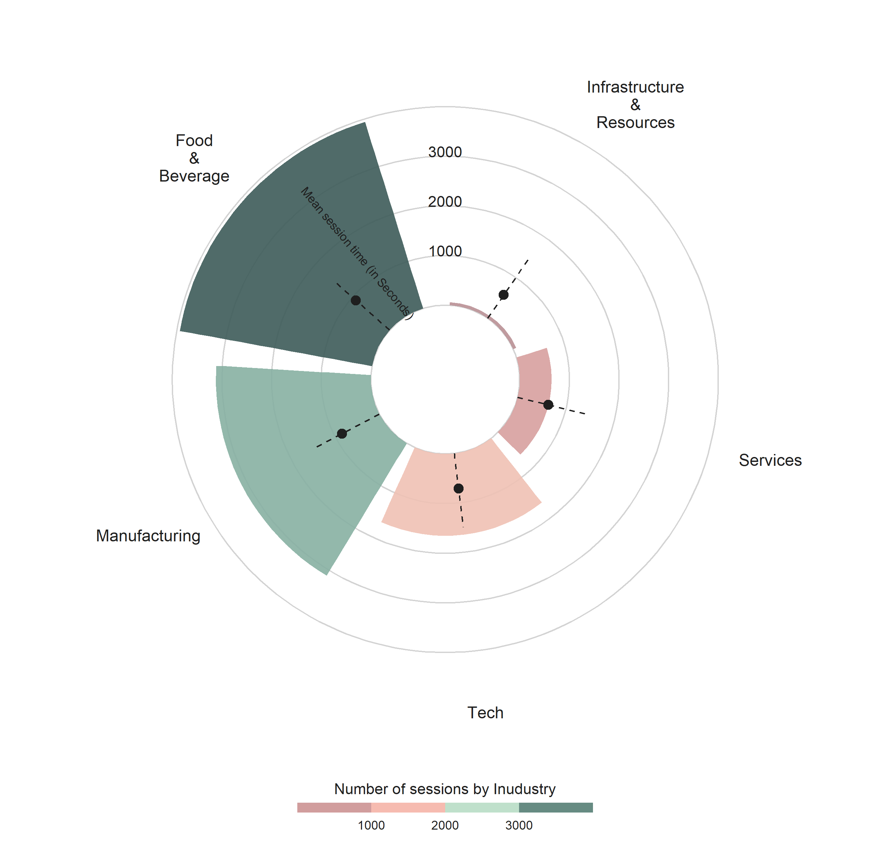

<link href="index_files\libs/wordcloud2-0.0.1/wordcloud.css" rel="stylesheet" />

## Summary

-   Understanding customer interaction can aid in the understanding of
    how customers engaged with the platform and drive strategic business
    decisions,
-   Over the 6 month period (March to August 2021), there were 3,700
    business that used the *MyNZTE* platform, with 11,000 unique
    sessions across the period that averaged 15 minutes long per session
    (though this varies considerably),
-   With most users predominately based in the Manufacturing and Food
    and Beverage sectors.
-   Most customers use the **Discover** function and tend to spend their
    time frequently viewing articles and scrolling the **Home** and
    **Discover** landing,
-   User searches also tend to be centered around exports, Australia,
    China, growth, strategy and eCommerce.

## MyNZTE Customer Engagement

Understanding customer interactions through online platforms offers
several key advantages in understanding how services provided are
indeed, having the desired engagement you want. That is, website data
can reveal how long customers spend on the site per session, how many of
them 'bounce' after logging in, most frequently used functions or
actions they take, and summarised search queries can reveal what might
be 'top of mind' for your customers.

All of this readily available data can help guide website investment
decisions, reveal how customers consume content, figure out current
topics of interest, and identify where engagement might not be working
as well.

Over the six months from March through to August of 2021, *MyNZTE* had
about 11,000 unique customer sessions, which came from about 3,700
different organisations of which a third were the NZTE focus group.
While the length of each session varied widely across the customer base
(from 0 minutes to an entire day), the mid-point of each session across
users was about 1 minute (see [Figure 1](#fig-user)). In combination,
the bounce rate for the website across this period was about 23% -
suggesting almost *80%* of *MyNZTE* users are engaging beyond a single
page view, relative to 23% of the sessions, in which users left
immediately after logging on.

<figure>

<figcaption aria-hidden="true">Figure 1: Number of user sessions over
the 6 month period</figcaption>
</figure>

Given *MyNZTE* is a for business platform, user activity across the day
occurs largely during the working hours (9am to 5pm), with most sessions
occurring around the mid-morning (as shown by
[Figure 2](#fig-session-day-1)), following a second peak post lunch.
Most activity occurs across the working week, peaking on Thursday, with
little activity occurring over the weekend
([Figure 3](#fig-session-day-2)).

<figure>

<figcaption aria-hidden="true">Figure 2: Customer sessions across the
week day</figcaption>
</figure>

<figure>

<figcaption aria-hidden="true">Figure 3: Customer sessions during time
of day</figcaption>
</figure>

Timeline of customer sessions over the 6 month period

## Varying levels of meanginful engagement

While the number of industry based users are predominantly in
manufacturing (35%), followed by food and beverage (28%), then tech
(24%) and services (13%), the largest user activity comes from the food
and beverage sector making up 42% of activity, then manufacturing
(making up 33%). However, the tech and services industries users tend to
be under-represented in activity relative to the total number of
organisations on the platform (as shown in [Figure 4](#fig-industry)).

However, despite the lower user engagement from the services and tech
businesses, the average time spent on the platform across sectors,
doesn't vary drastically, with tech and services spending the least
amount of time on average (11 minutes) and food and beverages spending
the most (about 15 minutes on average). Suggesting that, while *MyNZTE*
might have the highest engagement from the food, beverage and
manufacturing businesses, the platform is catering to the tech and
service businesses needs.

<figure>

<figcaption aria-hidden="true">Figure 4: industry</figcaption>
</figure>

[Figure 5](#fig-session-groups) shows the total number of times an
organisation has engaged with the platform as well as total time spent
by the two NZTE customer segments (Focus vs. Engaged) over the 6 month
period. The focus group tends to repeatedly use the platform more, with
an average log-in rate of 5.3 times per business over the 6 month
period, compared to engaged businesses, who on average had a log-in rate
of 2.5. This also corresponds to a higher session length time for the
focus group, who tend to use *myNZTE* 14 minutes per session on average,
compared to the engaged group, in which the central tendency was 9
minutes per session.

<figure>

<figcaption aria-hidden="true">Figure 5: Organisation uses vs time
spent</figcaption>
</figure>

## Understanding the *MyNZTE* value-add

How customers spend their time on the platform reveals where they find
the most value-add on the website. From a business perspective this is
important feature that will help guid future platform upgrades, content
prioritisation, and maintenance efforts.

The **Discover** function has the largest number of hits, just shy of
20,000 (making up 33% of total hits), which is true for both the engaged
and focus groups (see [Figure 6](#fig-action-1)). This is followed by **Session** (of
11,000 hits), **Home** (of 7,100 hits), and then **Attend** (of 6,900
hits). Aside from logging in, customers across both groups tend to view
articles the most (15% of total user activity), scroll the home landing
(15%), scroll the discover landing (11%), and the attend landing page
(7%). Suggesting that this is where they glean the most useful content
from the *MyNZTW* platform and shows where they're likely to spend most
of their time ( [Figure 7](#fig-action-2) ).

<figure>

<figcaption aria-hidden="true">Figure 6: Customers function
choice</figcaption>
</figure>

<figure>

<figcaption aria-hidden="true">Figure 7: Customer action
choice</figcaption>
</figure>

Where do customers often natigate to

## What are Customers looking for?

Search queries can provide a useful insight into what customers are
thinking. [Figure 8](#fig-word-1) & [Figure 9](#fig-word-2) sets out the most frequent word occurrences
across searches between the two customer segments. In this case, Amazon,
market, Australia, export, and China are some of the most frequently
reoccurring word searches that occur across both groups. However, these
are some interesting differences between the two groups. Where the focus
groups has more search terms centered around, growth, marketing,
strategy and eCommerce. The engage group has frequent search terms such
as, Manuka honey, business, potential, sustainability.

<figure>

<figcaption aria-hidden="true">Figure 8: Engaged Customers</figcaption>
</figure>

<figure>

<figcaption aria-hidden="true">Figure 9: Focus Customers</figcaption>
</figure>

A frequency word count on search quries

We can also visualise search terms via word clouds, to produce something
more evocative. The below word cloud is a combination of word searches
across both groups.

A wordcloud of search queries

## Customer Target Markets

For organisation where a target market is present ( about 765), the
United States (294), Australia (268), China (139), and the United
Kingdom (85) are the most targeted markets across those organisations
(see [Figure 10](#fig-worldmap)). Interestingly, despite the limited
market access, relative to the other countries, of which New Zealand has
trade agreements in place, the United States is still a sought after
market for business expansion. The high number of target markets for
Australia, may support the narrative that New Zealand businesses looking
to export, are said to 'cut one's teeth' on the Australian market first,
before expanding further and could represent smaller business who are
looking try there hand at exporting. Target market access to China, is
likely driven by the food and beverages industries, where price premiums
are likely to be the highest.

<figure>

<figcaption aria-hidden="true">Figure 10: Number of Target Markets by
Organisation</figcaption>
</figure>
